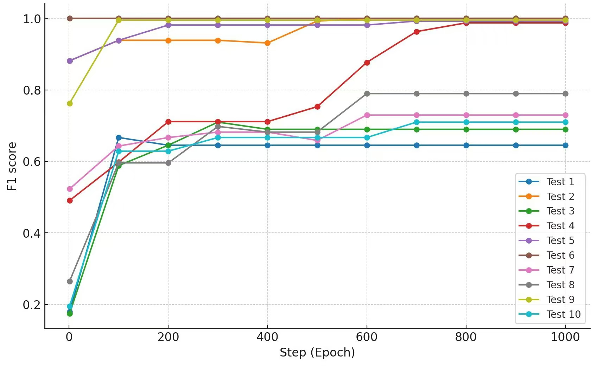

***

# EvoGraph 
### Simple and fast C# library for genetic algorithms. 
Originally was designed for solving graph based problems, so examples included in test project (equivalence matrix denoising and chromatic number search of a graph). 

***

## Short API overview
To start using this library, you should implement:
```C#
public interface IAgent;    // provide implementation of mutation and crossover 
                            // (and optionaly distance between agents chromosomes) 
```
```C#
public interface IFitnessFunction;  // calculates fitness function of all agents in species
                                    // and sort them by its value                
```
You also can override default implementation of:
```C#
public interface IOffspringStrategy;
```
Then the basic usage:
```C#
var strategy = new OffspringStrategyExample();
var manager = SpeciesManager.Get(strategy, agents);
var fitness = new FitnessFunctionExample(func);
var genAlg = new GeneticAlgorithm(manager, fitness);

for (var _ = 0; _ < maxIterations; _++)
{
    var res = genAlg.Step().BestFitness;
    if (Math.Abs(res) < threshold) break;
}
```

***

## Key features

Minimalistic and flexible implementation of evolution algorithm. Also includes Test project with examples of usage.

This lib supports:
1. All kinds of fitenss functions and testing objects
2. Division of agents by species (e.g. for NEAT)
3. Automatically log results to project 'bin' folder (useful for diagrams and estimating the results) 

Example results of MatrixRecoveryTest in the EvoGraphTest project




*** 

## License
EvoGraph is licensed under the MIT License. You can find the full license text in the `LICENSE` file in the repository.

***
